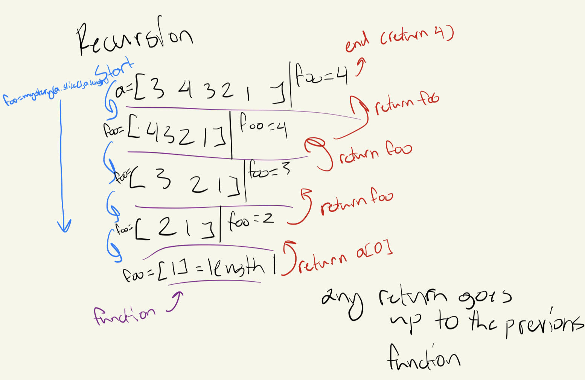

[](https://classroom.github.com/a/GDPVb20V)
# Mystery Function

What does the `mystery()` function in the following piece of code do? Add your
answer to this markdown file.

```javascript
function mystery(a) {
    if(a.length == 1) return a[0];
    var foo = mystery(a.slice(1, a.length))
    if(foo > a[0]) return foo;
    else return a[0];
}
```
# Conclusion: Recursion is amazing! 

I think my notes on my `mysteryCode.js` file is a lot more in depth than what I'll write here but basically this blew my mind wide open. 



This is an example I used to explain recursion with Tyler in lab today (He helped me understand was recursion was) Basically the code finds the largest number 
in an array. I used a test array literally just called `array` with numbers `[3, 4, 3, 2, 1]` and I wrote what my output was in the `mysteryCode.js` (can you 
tell I love to use `this` feature? I don't know what it's called but I love it haha) So this code starts off by opening a function over and over, each time 
making a smaller array, until it get's to an array of length one and returns the only item in it. That becomes the vaue it compares to the other item in the 
array in the parent function, comparing all the way up finding the biggest value and returning that, closing the function and going back to a parent funcion 
until it finally returns in the original function and gives us the biggest number. 

